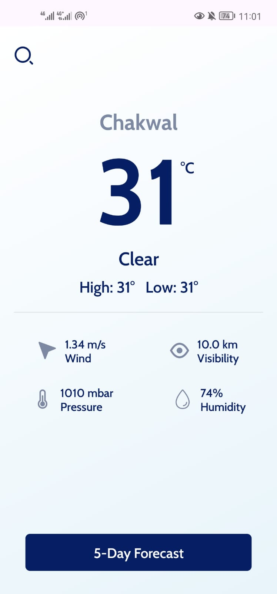
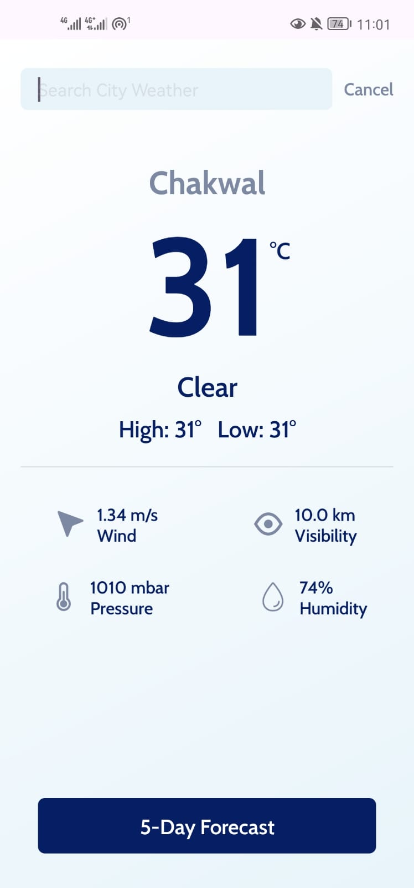
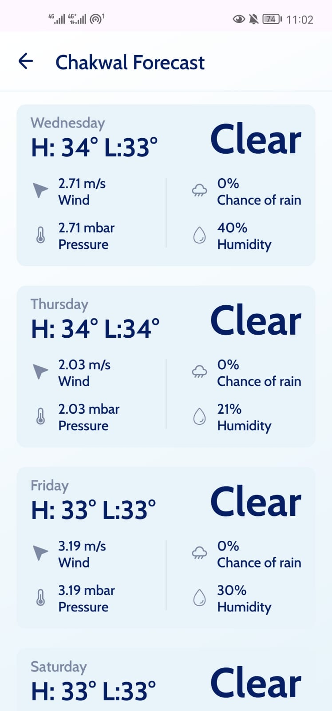

# Weather App 🌤️

A simple and efficient weather application built with Kotlin for Android. This app uses the [OpenWeatherMap API](https://openweathermap.org/) to fetch current weather conditions and 5-day weather forecasts for any city around the world.

## Features ✨

- **Current Weather:** Get real-time weather updates, including temperature, humidity, wind speed, and more.
- **5-Day Forecast:** View a detailed 5-day forecast with temperature highs, lows, and general weather conditions.
- **Offline Support (Caching):** Weather data is cached locally using **Room Database**, allowing users to access previously fetched data when there’s no internet connection.
- **City Search:** Search weather data by entering any city name globally.
- **User-Friendly UI:** A clean and modern design with easy navigation for quick weather updates.

## Endpoints Used 🌍

This app uses two primary endpoints from the OpenWeatherMap API:

1. **Current Weather Data:**
   - API Endpoint: `https://api.openweathermap.org/data/2.5/weather`
   - Retrieves the current weather data for a specified city, including temperature, humidity, pressure, visibility, wind speed, and general conditions.
   
2. **5-Day Weather Forecast:**
   - API Endpoint: `https://api.openweathermap.org/data/2.5/forecast`
   - Provides a detailed 5-day forecast data including temperature, chance of rain, weather conditions, and wind speed.

For more information, refer to the official [OpenWeatherMap API documentation](https://openweathermap.org/api).

## Offline Support with Room Database 🗄️

The app uses **Room Database** to cache weather data for later retrieval. If the user loses internet connectivity or is offline, the app displays the weather data from the local cache. This ensures the user has access to weather information even when offline.

### Key Features of Room Integration:
- **Data Caching:** Stores weather data locally.
- **Improved User Experience:** Reduces API calls by fetching cached data, leading to better app performance.

## Screenshots 📸

<div style="display: flex;">
  
  
  
</div>

## Demo Video 🎥

https://github.com/user-attachments/assets/53be7627-ac0a-4079-9a79-4faff1d13488

## Technologies Used 🛠️

- **Kotlin:** Primary language for building Android applications.
- **Coroutines:** Used for asynchronous programming and managing API calls.
- **Retrofit:** HTTP client for handling REST API requests and responses.
- **Room Database:** For caching weather data locally to enable offline access.
- **ViewModel & Flows:** Android Jetpack components for managing UI-related data and lifecycle awareness.
- **Material Design Components:** For creating a sleek, user-friendly interface.
- **OpenWeatherMap API:** Fetches weather and forecast data.

## Setup Guide ⚙️

### Prerequisites
1. An API key from [OpenWeatherMap](https://openweathermap.org/appid).
2. Android Studio installed (latest version recommended).
3. Gradle (comes with Android Studio).

### Steps to Run the App
1. Clone this repository:
    ```bash
    git clone https://github.com/muhammadhamzajanjua786/weather-app.git
    cd weather-app
    ```
2. Open the project in Android Studio.
3. Add your OpenWeatherMap API key in the `local.properties` file:
    ```
    WEATHER_API_KEY="your_api_key_here"
    ```
4. Sync the project to install dependencies.
5. Build and run the app on an Android emulator or physical device.

## API Key Configuration 🔑

To use the app, you'll need to get a free API key from [OpenWeatherMap](https://openweathermap.org/). Follow these steps:

1. Go to [OpenWeatherMap](https://home.openweathermap.org/users/sign_up) and sign up for an account.
2. Generate an API key from the API section.
3. Add the API key in `local.properties` under the key `WEATHER_API_KEY`.

## How It Works 💡

- **Fetch Weather Data:** When a user searches for a city, the app sends a request to the OpenWeatherMap API using Retrofit and fetches the current weather data.
- **Update UI:** The app displays the fetched weather information on the screen, including temperature, and weather conditions.
- **Error Handling:** Proper error messages are displayed if an invalid city is entered or if there's a network issue.

## Future Enhancements 🔮

- Improve the app's performance for slower network connections.

## License 📜

This project is licensed under the MIT License. See the [LICENSE](LICENSE) file for details.
